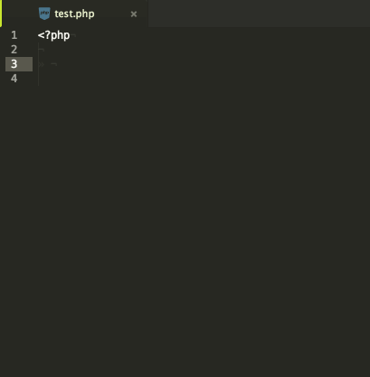

# autocomplete-php package
An Atom PHP autocompleter for `autocomplete-plus` with function completion.

This is an Alpha version.

### Requirements
- Atom `autocomplete-plus` package
  - (install with `apm install autocomplete-plus`)

### Installation
- `apm install autocomplete-php`
- or install through Atom's UI

### To-Do
- [x] Get local variables from current file (Need more work to better performance)
- [ ] Get local functions from current file
- [ ] Update option for list of internal php functions (Will need php installed)

